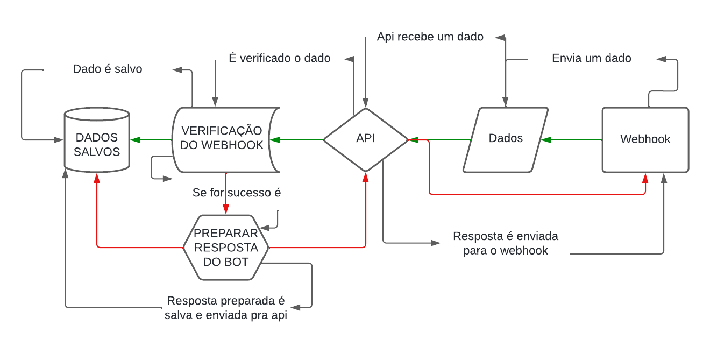
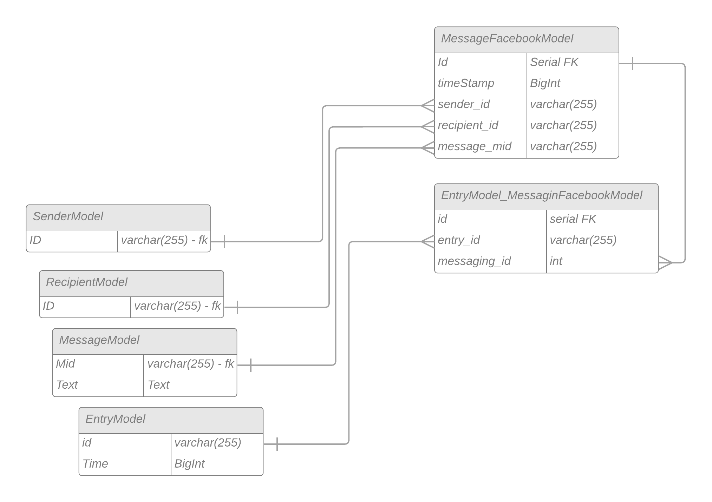
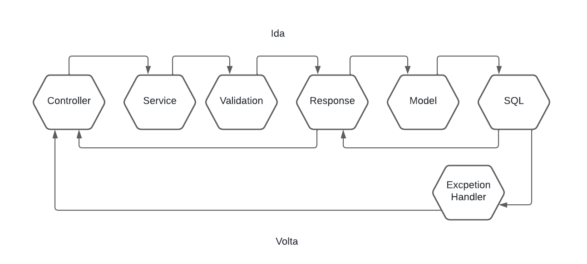

# api-facebook
Api for receive webhooks for Facebook Mensseger

# Modelo UML 

# Modelo do Banco

# Caminho da mensagem na API

# Query usada para gerar as tabelas do Banco na pasta SQL

# INFOS:

  # Request recebida no webhook da mensagem enviada pelo cliente:
 {"object":"page",
 "entry":[
             {
             "time":{{TIME_VARIABLE}},
             "id":"{{ID_OF_PAGE}}",
             "messaging":
                         [
                         {
                         "sender":
                         {
                            "id":"{{SENDER_ID}}"},
                            "recipient":
                                 {
                                    "id":"{RECIPIENT_ID}}"},
                                    "timestamp":{{TIMESTAMP_VARIABLE}},
                                    "message": 
                                        {
                                            "mid":"{{MID_VARIABLE}}",
                                            "text":"{{MESSAGE_tEXT}}"}
                         }
                         ]
 }
 ]
}
# Response recebida após envio da mensagem pela API 
{
 "recipient_id": "{{RECIPIENT_ID}}",
 "message_id": "m_8juDru7sB_YbxeqEwFVxBifA9H70pPrG3z_MeRPmDw5BRlpLhwZpoEeZh0-nPOPGKhAWR8en3PaTRj4CtzzNig"
 }

# Docker
    docker pull JSSO0/api-facebook
    docker run -d -p 8080:8080 JSSO0/api-facebook