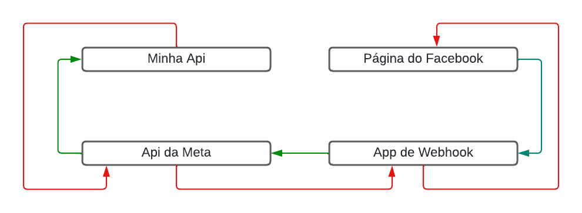
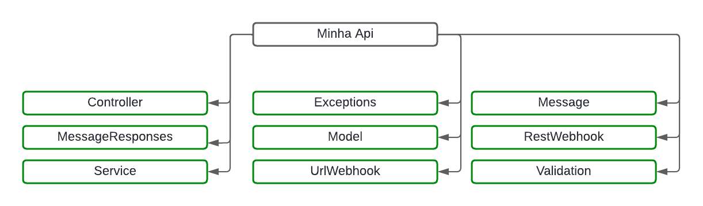
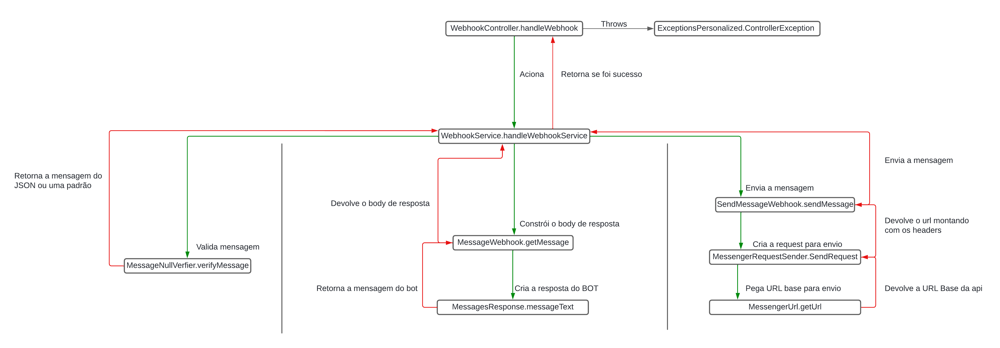

# api-facebook
Api for receive webhooks for Facebook Mensseger

# INSTRUÇÕES DE INSTALAÇÃO
 # tecnologias usadas:
    Java - 17
    Spring Boot - 3.2.4
    JDK do Docker - openjdk:17-alpine

 # Docker
    docker pull JSSO0/api-facebook
    docker run -d -p 8080:8080 JSSO0/api-facebook
 # Como usar
1 - Rode a API Localmente
2 - Exponha pelo NGROK a porta
3 - Pegue a URL e acesse o seu APP e troque pelo token gerado no seu STEP 2 das configs do APP e pela seguinte rota abaixo:
url: {{link do ngrok}}/webhookfacebook 
Será retornado status 200 para api validar o webhook

4 - Após isso mande uma mensagem na sua página

# PAGE do facebook para acessar
https://www.facebook.com/profile.php?id=61558000381317

# Modelo UML 

# Possível modelo do Banco

# Caminho da mensagem na API

# C4 MODEL CAMADA 1

# C4 MODEL CAMADA 3

# C4 MODEL CAMADA 4

# INFOS:

  # Exemplo Request recebida no webhook da mensagem enviada pelo cliente:
    {
    "object": "page",
    "entry": [
    {
    "time": 1713550279294,
    "id": "300107813175496",
    "messaging": [
    {
    "sender": {
    "id": "7612696888751001"
    },
    "recipient": {
    "id": "300107813175496"
    },
    "timestamp": 1713550278804,
    "message": {
    "mid": "m_lILx95nk4CD0AXhVuR0FFifA9H70pPrG3z_MeRPmDw5LPQIWPh7GLG_b-7kLPcaur-1PtQamB6TKgs7uefD9jw",
    "text": "Qual seu nome?"
    }
    }
    ]
    }
    ]
    }

# Exemplo de Response recebida após envio da mensagem pela API 
{
 "recipient_id": "{{RECIPIENT_ID}}",
 "message_id": "m_8juDru7sB_YbxeqEwFVxBifA9H70pPrG3z_MeRPmDw5BRlpLhwZpoEeZh0-nPOPGKhAWR8en3PaTRj4CtzzNig"
 }

