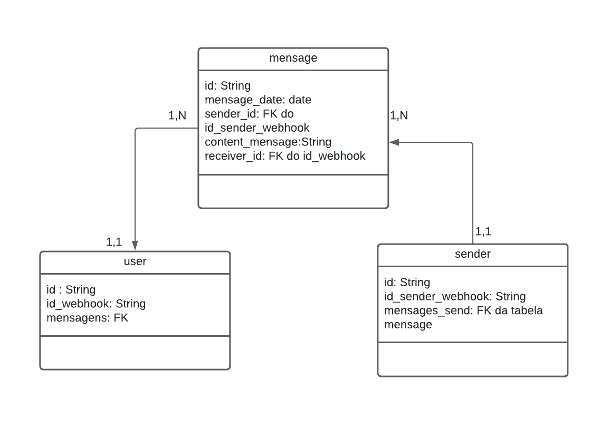

# api-facebook
Api for receive webhooks for Facebook Mensseger
# Modelo UML 

# Modelo do Banco

# Caminho da mensagem na API

# Query usada para gerar as tabelas do Banco

-- Tabela User
CREATE TABLE User (
    id UUID PRIMARY KEY DEFAULT uuid_generate_v4(),
    id_webhook VARCHAR(255),
    mensagens INT REFERENCES mensage(id)
);

-- Tabela Message
CREATE TABLE Message (
    id UUID PRIMARY KEY DEFAULT uuid_generate_v4(),
    mensage_date DATE,
    sender_id UUID REFERENCES sender(id),
    content_mensage TEXT,
    receiver_id VARCHAR(255) REFERENCES User(id_webhook)
);

-- Tabela Sender
CREATE TABLE Sender (
    id UUID PRIMARY KEY DEFAULT uuid_generate_v4(),
    id_sender_webhook VARCHAR(255),
    mensages_send UUID REFERENCES Message(id)
);
